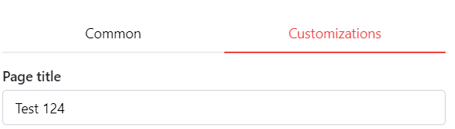

---
tags:
  - Customization
  - Design
  - Title
  - Custom
---

# Customize Page Title

You can change the page title to whatever you like.
Open settings by clicking the settings cog on the top right, and switch to the tab "Customizations".
Then, enter your custom title in the input field:

Press ``Save`` to apply your changes. After that, the page title will change.