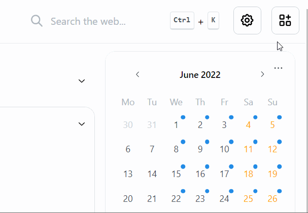

# Dark Mode

Homarr has a Dark Mode built-in, which is much more comforting to your eyes.
You can active the dark mode in your settings or via the [keyboard shortcuts](./../advanced-configuration/keyboard-shortcuts.md).

## Toggle Dark Mode in the Settings

To activate the darkmode over your settings, click on the cog icon at the top right and turn on the switch labeled "Switch to darkmode".

:::tip

Use the [keyboard shortcut](./../advanced-configuration/keyboard-shortcuts.md) for faster toggeling.

:::

## Preview of Dark Mode

