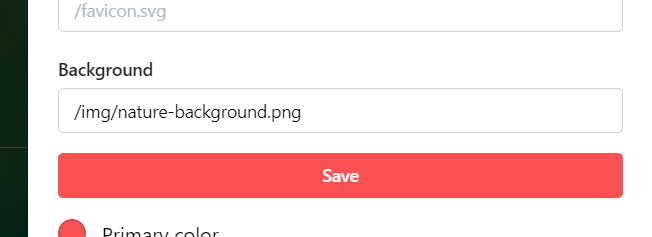
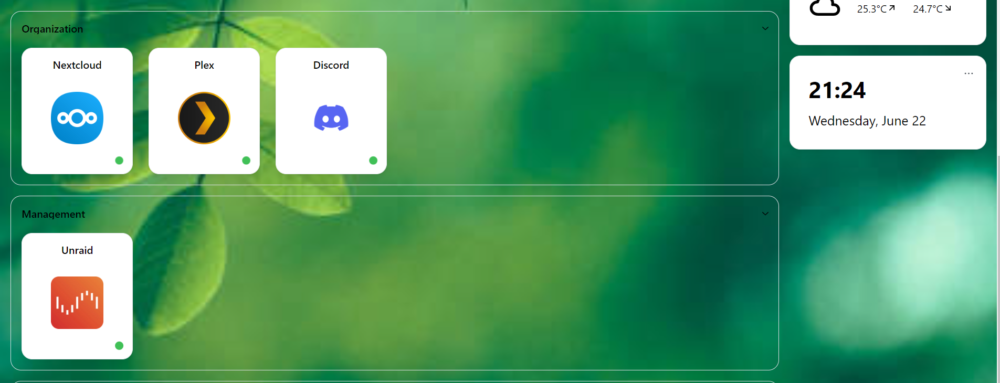

# Custom Background

To add a custom Homarr background, open the settings at the top right and click on the Tab "Customization".

:::tip

If you are using Docker, mount the path ``/app/public/`` and put the background inside of a folder called ``img``.

:::

Then, define your background in the input field:

Example with a custom background:

