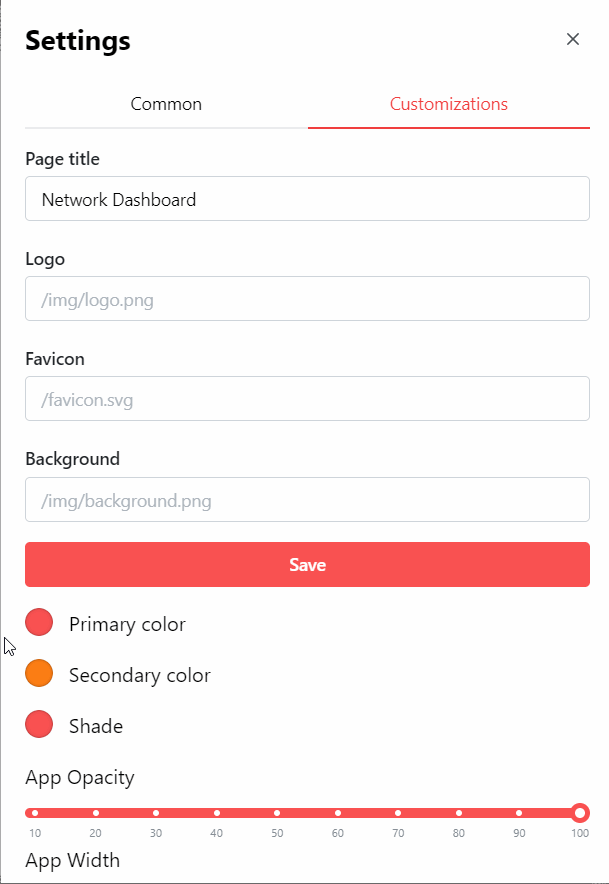

# Custom Colors

Homarr lets you customize the colors to adapt to your preferences.

## Pick a color

To customize the colors of your Homarr instance, open the settings and click on the Tab "Customization".

Then you may change the primary, secondary and shade color of Homarr.

## Pick your custom color

Currently, Homarr does not support fully custom colors (HEX, RGBA) yet. We'll work on this feature in the future.