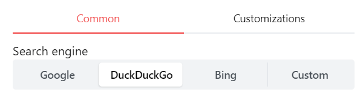
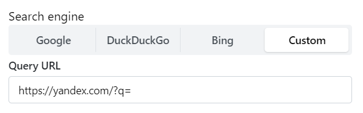

---
tags:
  - Customization
  - Design
  - Background
  - Custom
---

# Customize your Search Engine
## Select a Search Engine

If you use the search box module, you might want to configure your search engine.
Open settings by clicking the settings cog on the top right.
You can either select one of the default search engines, or you can provide a custom one.

## Use a custom search engine (private / public)

Some users are running their own search engines which index websites, or they use a non-listed search engine like [Yandex](https://yandex.com/).

Homarr let's you use any search engine you'd like.
Choose "Custom" from the collection of search engines.

Enter the search url from the engine. Usually, you can append ``?q=`` after the domain for most search engines.

Here is an example using Yandex:

Homarr will append your encoded search request at the end of the URL. If you are using your own self-hosted search engine, make sure that the access is not blocked and the search URL is correct.