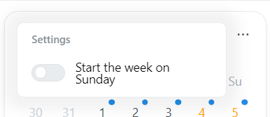

# 📆 Calendar Module

The calendar Module will use the Integrations to display upcoming content.
It can display upcoming conent from all supported media integrations.

:::tip

To integrate one of your services in the calendar, select the corresponding service type:

:::

## Activate the Module
Please read our documentation on [how to enable a module](./../index.md#activating-a-module).

## Configuration

| Configuration        | Description | Values | Default Value |
| -------------------- | ----------- | ------ | ------------- |
| Start week on sunday | Determines, if the calendar week should start on Sunday. If deactivated, Week will start on Monday. | yes / no | no |

:::tip

Check out our documentation on [how to configure a module](./../index.md#configure-a-module).

:::

## Screenshots

