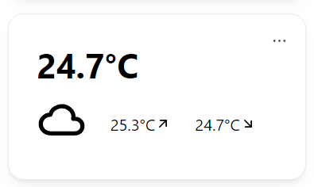

# ☔ Weather Module

The Weather Module uses your location to display the current, highest and lowest temperature. The Module uses [open-meteo.com](https://open-meteo.com) to retrieve weather data.

The Module **does not request your browsers location**, you must specify a location yourself using the Module's settings.

## Activate the Module
Please read our documentation on [how to enable a module](./../index.md#activating-a-module).

## Configuration

| Configuration         | Description | Values | Default Value |
| --------------------- | ----------- | ------ | ------------- |
| Display in Fahrenheit | Displays the temperature in °F. | yes / no | no |
| Current Location | City name for the weather data retrival | - | - |

:::tip

Check out our documentation on [how to configure a module](./../index.md#configure-a-module).

:::

## Screenshots

