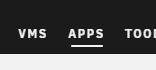
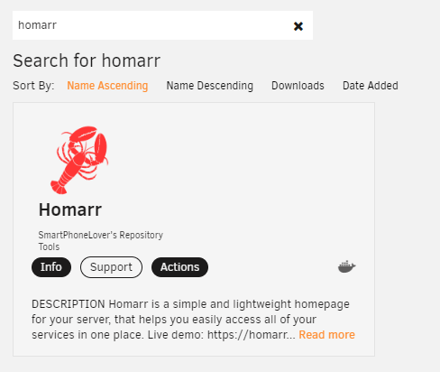

import Tabs from '@theme/Tabs';
import TabItem from '@theme/TabItem';

## Requirements
Hommar supports the following architectures:

| Architecture | Supported |
| ------------ | --------- |
| x86          | ✅        |
| x64          | ✅        |
| ARM64        | ✅        |
| ARM          | ✅        |

If you are installing Homarr using the Docker image, please ensure that you have the latest version of [Docker](https://docs.docker.com/get-docker/) installed on your system.

## Installation
### Quick start with Docker

The easiest way to get started is to use our Docker Image.

```bash
docker run  \
  --name homarr \
  --restart unless-stopped \
  -p 7575:7575 \
  -v ./homarr/configs:/app/data/configs \
  -v ./homarr/icons:/app/public/icons \
  -d ghcr.io/ajnart/homarr:latest
```

### Quick start with Docker Compose

Put the following content in a file called `docker-compose.yml`.
```yml
---
version: '3'
#---------------------------------------------------------------------#
#                Homarr -  A homepage for your server.                #
#---------------------------------------------------------------------#
services:
  homarr:
    container_name: homarr
    image: ghcr.io/ajnart/homarr:latest
    restart: unless-stopped
    volumes:
      - ./homarr/configs:/app/data/configs
      - ./homarr/icons:/app/public/icons
    ports:
      - '7575:7575'
```
Then, run `docker compose up -d`.

### Quick start with UNRAID
You can install Homarr on your UNRAID system without the usage of a terminal.
First, install the [community apps plugin](https://forums.unraid.net/topic/38582-plug-in-community-applications/).

:::tip
If you're unsure whether you have the plugin installed or not, search for this tab in the navigation:


:::

Search for ``Homarr`` and click on the application:



Click on Install and adjust the settings to your liking.
After you click submit, UNRAID will automatically start the installation. You can find Homarr under the tab "Docker" afterwards.

### Quick start with building from source
:::tip

Installing from source is not recommended, if you don't know what you're doing and/or are not planning to make changes to the source code, please install Homarr using [Docker](#quick-start-with-docker).

:::

<Tabs>
  <TabItem value="orange" label="Yarn Package Manager" default>
    <ul>
      <li>Clone the Repository using <code>git clone https://github.com/ajnart/homarr.git</code></li>
      <li>Enter the created directory using <code>cd homarr</code></li>
      <li>Install all dependencies using <code>yarn install</code></li>
      <li>Build the source using <code>yarn build</code></li>
      <li>Start the NextJS web server using <code>yarn start</code></li>
    </ul>
  </TabItem>
  <TabItem value="apple" label="NPM Package Manager">
    <ul>
      <li>Clone the Repository using <code>git clone https://github.com/ajnart/homarr.git</code></li>
      <li>Enter the created directory using <code>cd homarr</code></li>
      <li>Install all dependencies using <code>npm install</code></li>
      <li>Build the source using <code>npm build</code></li>
      <li>Start the NextJS web server using <code>npm start</code></li>
    </ul>
  </TabItem>
</Tabs>

## Having Trouble?

If you are having trouble getting Homarr to install properly on your system, check out our [FAQ page](https://homarr-docs.vercel.app/docs/community/frequently-asked-questions).
Should your issue persist, contact us on Discord: [Join Discord Server](https://discord.gg/aCsmEV5RgA)