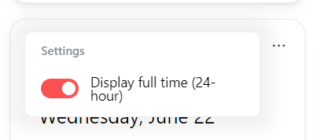
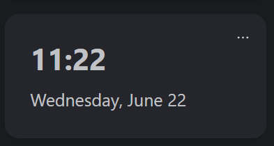

# 🕓 Clock Module

The Clock Module will display the current time and date. The Module will use your current system time. If you are using Docker, ensure that the timezone is set correctly.

## Activate the Module
Please read our documentation on [how to enable a module](./../index.md#activating-a-module).

## Configuration

| Configuration         | Description | Values | Default Value |
| --------------------- | ----------- | ------ | ------------- |
| Display full time (24 hour format) | Determines if the clock displays in 12 or 24 hour format | yes / no | yes |

:::tip

Check out our documentation on [how to configure a module](./../index.md#configure-a-module).

:::

## Screenshots

