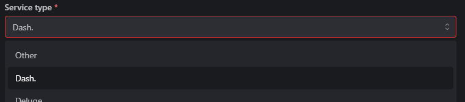
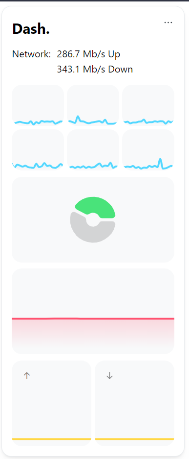

---
tags:
  - Modules
  - Dashboard
  - Dash.
  - Dashdot
  - Integration
  - Statistics
  - iFrame
---

# 📟 Dash. Module

The Dash. module will integrate your existing Dash. instance into Homarr. The graphs will be integrated using [iframe](https://developer.mozilla.org/en-US/docs/Web/HTML/Element/iframe).
Additionally, you can enable or disable certain graphs, or enable the Multi-Core view for the CPU.

## Activate the Module
Please read our documentation on [how to enable a module](./../index.md#activating-a-module).

If you want to quickly test the module, before installing Dash. on your machine, we recommend to use the public demo server of Dash.:
https://dash.mauz.io/
Please adhere to the configuration on how to use the demo server.

## Initial setup
For using this module with real data from your server, you need to install https://github.com/MauriceNino/dashdot on your server. We recommend that you use their Docker Container for the easiest and fastest installation.

### Install Dash. using Docker
```
docker container run -it \
  -p 80:3001 \
  -v /:/mnt/host:ro \
  --privileged \
  mauricenino/dashdot
```

### Install Dash. using Docker compose
``` 
version: '3.5'

services:
  dash:
    image: mauricenino/dashdot:latest
    restart: unless-stopped
    privileged: true
    ports:
      - '80:3001'
    volumes:
      - /:/mnt/host:ro
```

### More Installation options
We recommend that you refer to the original documentation from Dash.:
https://getdashdot.com/docs/install

## After Installation

After you've installed Dash., you must add it as a service to your Homarr Dashboard.
If you haven't added a service before, check out our [guide on how to add a service](./../../quick-start/manage-services.md#adding-a-service).

Make sure, that you've selected ``Dash.`` in the dropdown for the service type, so Homarr can embed it into your Dashboard:



## Configuration
| Configuration         | Description | Values | Default Value |
| --------------------- | ----------- | ------ | ------------- |
| CPU Multi-Core View | Shows the usage of each core instead of the total usage | yes / no | no |
| Storage Multi-Drive View | Shows the usage of each drive visible to Dash. instead of the total usage | yes / no | no |
| Use Compact View | Reduce the size of the individual graphs, which makes them use less space. Recommended for smaller screens | yes / no | no |
| Graphs | Selection of the Dash. graphs, which should be displayed | yes / no | CPU, RAM, Storage, Network |


## Reverse Proxy Configuration
Homarr will embed the graphs of your Dash. instance.
Because of this, some users may experience problems, if they serve their Dash. instance using a reverse proxy.
While there are multiple reasons for this, the most common by far is that the reverse proxy is blocking access to Dash. using [iframes](https://developer.mozilla.org/en-US/docs/Web/HTML/Element/iframe).

Depending on which reverse proxy you're using, you must configure them differently to allow access via iframes.
Please note that iframes can be considered dangerous under some circumstances - we recommend you to read this answer on Stackoverflow entirely for understanding the risks involved with iframes (especially when you expose via a public domain): https://stackoverflow.com/a/9428051/15257712

If you want to proceed, you must configure this header on your reverse proxy: https://developer.mozilla.org/en-US/docs/Web/HTTP/Headers/X-Frame-Options. Generally, in most cases you want to use ``SAMEORIGIN``. ``ALLOW-FROM <uri>`` is obsolete and no longer works in most browsers.

## Screenshots

