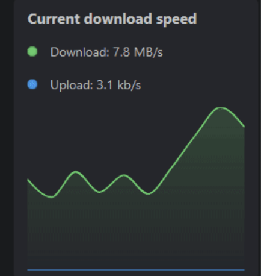

---
tags:
  - Modules
  - Speed
  - Measurements
  - ISP
---

# 🚀 Download Speed Module

The download speed module integrates with your existing download services via [integrations](./../../advanced-configuration/integrations.md). It refreshes each second and will display the last 10 measurements of the download and upload speed of your download services.

## Activate the Module
Please read our documentation on [how to enable a module](./../index.md#activating-a-module).

## Configuration

This module does not offer any configurations. You may configure your download client services instead.

## Screenshots

