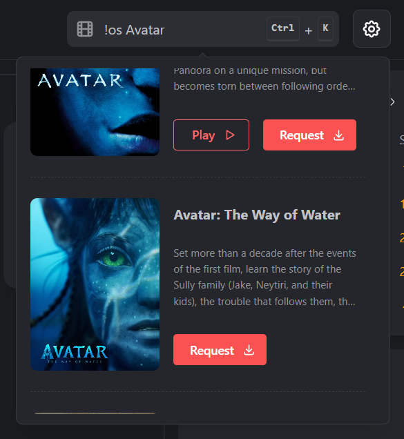
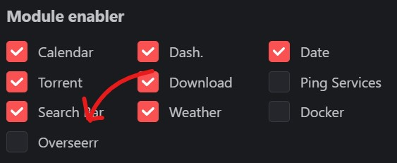
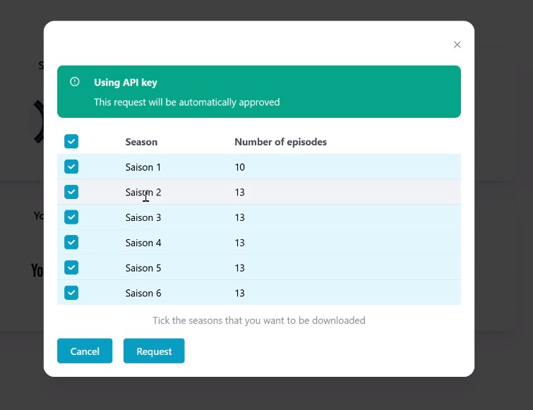

---
tags:
  - Modules
  - Integration
  - Overseerr
  - Jellyseerr
  - Movies
  - Series
  - Media
  - Management
---

import Tabs from '@theme/Tabs';
import TabItem from '@theme/TabItem';

# 👀 Overseerr Module

The [Overseerr](https://overseerr.dev/) module will enable you to request movies and series directly from your Homarr dashboard:

It displays, which content is already in your Overseerr library and links availble content directly to your [Plex](https://www.plex.tv/) or [Jellyfin](https://jellyfin.org/) instance.

## Initial setup
### Installation of Media Server
The Overseer integration supports both Overseer and Jellyseer, a fork of Overseer compatible with Jellyfin.

<Tabs groupId="media-server">
  <TabItem value="plex" label="🎬 Plex Media Server">
    

      Install Plex on your machine using your preferred installation method: <a href="https://www.plex.tv/">https://www.plex.tv/</a> 
      We recommend the installation using Docker for the easiest and fastest installation.
    

  </TabItem>
  <TabItem value="jellyfin" label="🎬 Jellyfin Media Server">
    

      Install Jellyfin on your machine using your preferred installation method: <a href="https://jellyfin.org/docs/general/administration/installing.html">https://jellyfin.org/docs/general/administration/installing.html</a> 
      We recommend the installation using Docker for the easiest and fastest installation.
    

  </TabItem>
</Tabs>

### Installation of Media requester

<Tabs groupId="media-server">
  <TabItem value="plex" label="🎬 Plex Media Server">
    

      After you have your Plex instance up and running, you must install Overseer as your media request application. Please read the official documentation of how to install Overseerr on your machine: <a href="https://docs.overseerr.dev/getting-started/installation">https://docs.overseerr.dev/getting-started/installation</a>.
    

  </TabItem>
  <TabItem value="jellyfin" label="🎬 Jellyfin Media Server">
    

      Oficially, Jellyfin is not supported by Overseerr. This is why Jellyfin users must use a fork of the official Overseerr project, which was modified to work with Jellyfin: <a href="https://github.com/bignuto/jellyseer">https://github.com/bignuto/jellyseer</a>. 
      We recommend the installation using Docker for the easiest and fastest installation.
    

  </TabItem>
</Tabs>

### Activate the module
Click on the settings on the top right. Toggle the checkbox to enable the Overseerr module:

### Add your service in Homarr
After the module was enabled, add the service to your Dashboard.

<Tabs groupId="media-server">
  <TabItem value="plex" label="🎬 Plex Media Server">
    

      Select <code>Overseerr</code> in the service type for your Overseerr service. 
      Fill our the field <code>Api token</code> with from the link below, when having <code>Overseerr</code> as the service type selected.
    

  </TabItem>
  <TabItem value="jellyfin" label="🎬 Jellyfin Media Server">
    

      Select <code>Jellyseerr</code> in the service type for your Jellyseer service. 
      Fill our the field <code>Api token</code> with from the link below, when having <code>Jellyseerr</code> as the service type selected.
    

  </TabItem>
</Tabs>

## Searching for a movie / series
To search for a movie or series, simply press ``CTRL`` + ``K`` or click into the search box.
Then, type ``!os`` (with a space at the end) and enter, what you want to search for.

The integration will display, what content is already available in your media library.

## Seasons selection
If you're selecting a series, you'll be asked what seasons you want to request:

