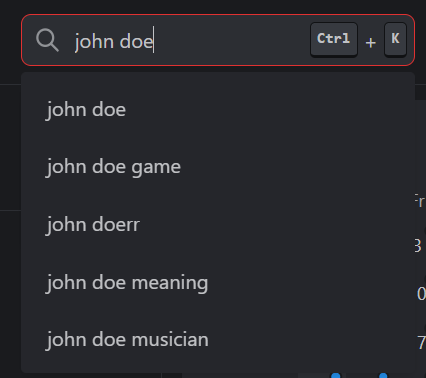

# 🔍 Search Module

The Search module will add a search bar on the top right of your page. It can also be opened using the [key shortcuts](./../../advanced-configuration/keyboard-shortcuts.md).

The Search Bar is able to search on your [configured search engine](./../../customizations/custom-search-engine.md), on https://bitsearch.to/ for torrents and on YouTube for videos.

If you want to search for torrents, prefix your search with `!t`. If you want to search for a youtube video, prefix your searchw with `!yt`.

## Activate the Module
Please read our documentation on [how to enable a module](./../index.md#activating-a-module).

## Configuration

The Search Bar cannot be configured.

## Screenshots

