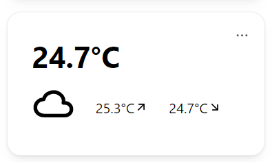
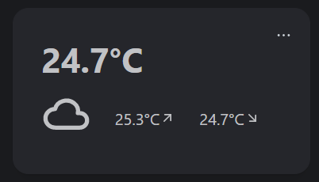

# ☔ Weather Module

The Weather Module uses your location to display the current, highest and lowest temperature. The Module uses [open-meteo.com](https://open-meteo.com) to retrieve weather data.

The Module **does not request your browsers location**, you must specify a location yourself using the Module's settings.

## Activate the Module
Please read our documentation on [how to enable a module](./../index.md#activating-a-module).

## Configuration

| Configuration         | Description | Values | Default Value |
| --------------------- | ----------- | ------ | ------------- |
| Display in Fahrenheit | Displays the temperature in °F. | yes / no | no |
| Current Location | Location name. Can be pretty much anything and should be as percise as possible. | - | - |

  
I am having issues / false data with the weather. What can I do?

  

    
If your location does not have a unique name or the displayed data is wrong, take these steps to fix it:
    <ul><li>Go to <a href="https://open-meteo.com/en/docs/geocoding-api">open-meteo</a> api documentation and enter your location</li><li>Adjust your search query until the first result is the correct location</li><li>Copy the search query and paste it into the <code>Current location</code> field in the configuration.</li></ul> We suggest you to check whether the displayed data is equal to the data of your local weather station.

  

:::tip

Check out our documentation on [how to configure a module](./../index.md#configure-a-module).

:::

## Screenshots

