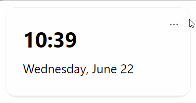

# Overview of Modules

Modules are extensions for your Homarr instance, which help you expand and personalize your experience. You can enable or disable them to your preferences.

:::tip

Check out our [list of built-in modules](built-in-modules/index.md#list-of-built-in-modules) to see what modules are available.

:::

## Activating a Module

To activate a module, click on the settings icon at the top right, and check the modules you want to enable.

After you selected a module, it will enable automatically and appear on your screen.

## Configuring a Module

Most Modules have multiple settings you can configure.
A Module will have three dots at the top-right, if it can be configured.

Click on the three dots to open the Modules settings.
For instance, you can configure the Clock Module to use the 24 or 12 hour format:

## Deactivate a Module

You can deactivate a module the same way, as you activated it. Simply click on the settings icon and uncheck the module.