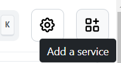
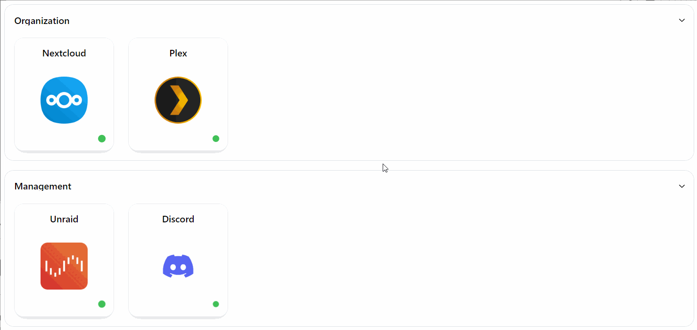

# Manage your Services
Congratulations! You've installed Homarr. You're probably just seeing a blank page now. Learn how to add your services below.

## Adding a service

First, click on the "Add Service" button on the top right of your page:

Next up, you'll be able to enter the details of your service.
You must enter a name and a service URL.
Changing the name will automatically search for the matching icon.
However, you may change the icon to your preferences.

:::info
Icons are automatically requested from [dashboard-icons](https://github.com/walkxhub/dashboard-icons). You can learn more about this [here](../advanced-features/custom-icons.md).
:::

## Re-ordering services
After you've added a few services, you can re-order them for better organization. Click and hold for atleast .25 seconds — then the item will enter the drag and drop mode. You can now drag the item to any preferred location.

## Making groups
If you do not specify a category, servies will appear under the default category "Others".
You may add custom categories to organize your services.
To change or add a category, click on your service and edit the category field:

Groups are collapsable. Collapse them by clicking on the title-bar of a category.

